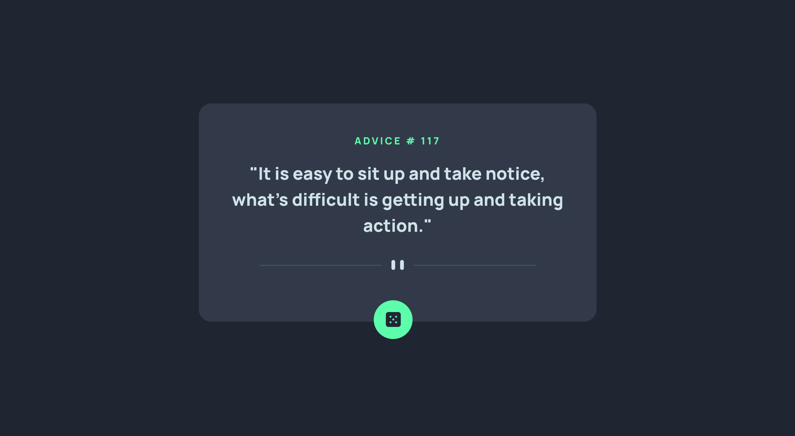

# Frontend Mentor - Advice generator app solution

This is a solution to the [Advice generator app challenge on Frontend Mentor](https://www.frontendmentor.io/challenges/advice-generator-app-QdUG-13db). Frontend Mentor challenges help you improve your coding skills by building realistic projects.

## Table of contents

- [Overview](#overview)
  - [The challenge](#the-challenge)
  - [Screenshot](#screenshot)
  - [Links](#links)
- [My process](#my-process)
  - [Built with](#built-with)
  - [What I learned](#what-i-learned)
  - [Continued development](#continued-development)
  - [Useful resources](#useful-resources)
- [Author](#author)

## Overview

### The challenge

Users should be able to:

- View the optimal layout for the app depending on their device's screen size
- See hover states for all interactive elements on the page
- Generate a new piece of advice by clicking the dice icon

### Screenshot

### Links

- Solution URL: [Repo](https://github.com/elizabethrsotomayor/advice-generator-app)
- Live Site URL: [Live Site](https://elizabethrsotomayor.github.io/advice-generator-app/)

## My process

### Built with

- Semantic HTML5 markup
- CSS custom properties
- Flexbox
- Mobile-first workflow

### What I learned

I learned about the fetch API and request/response objects.

### Continued development

I want to gain more experience with making API calls and working with data received from the API.

### Useful resources

- [MDN Fetch Documentation](https://developer.mozilla.org/en-US/docs/Web/API/Fetch_API) - This was the example fetch API call that I went off of.
- [MDN Working with Objects](https://developer.mozilla.org/en-US/docs/Web/JavaScript/Guide/Working_with_Objects) - Accessing object properties.

## Author

- Website - [Elizabeth Sotomayor](https://elizabethrsotomayor.github.io/somyo2/)
- Frontend Mentor - [@elizabethrsotomayor](https://www.frontendmentor.io/profile/elizabethrsotomayor)
- Twitter - [@lahijadelmar\_](https://www.twitter.com/lahijadelmar_)
